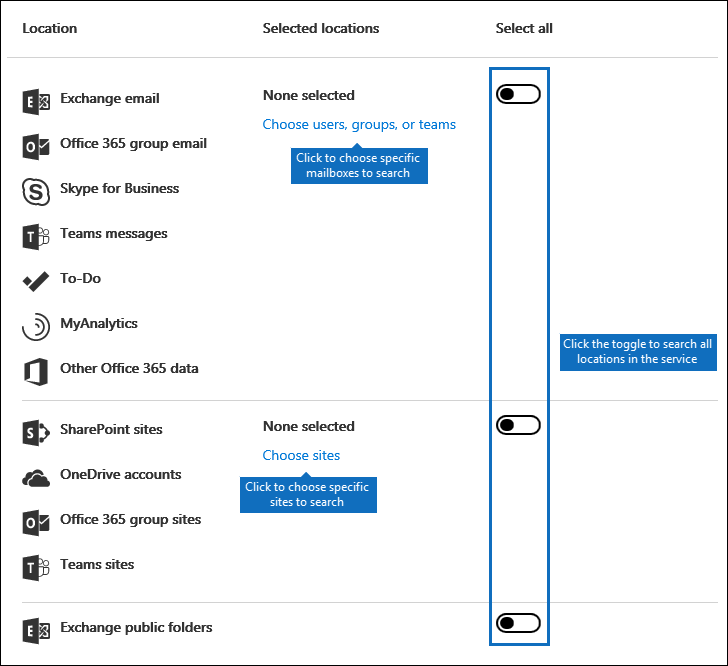

# Content Search in Office 365

You can use the Content Search eDiscovery tool in the Office 365 Security &amp; Compliance Center to search for in-place items such as email, documents, and instant messaging conversations in your Office 365 organization. Use this tool to search for items in these Office 365 services:
  
- Exchange Online mailboxes and public folders
    
- SharePoint Online sites and OneDrive for Business accounts
    
- Skype for Business conversations
    
- Microsoft Teams 
    
- Office 365 Groups
    
After you run a Content Search, the number of content locations and an estimated number of search results are displayed in the search profile. You can also quickly view statistics, such as the content locations that have the most items that match the search query. After you run a search, you can preview the results or export them to a local computer.


## Create a new search

To have access to the **Content search** page to run searches and preview and export search results, an administrator, compliance officer, or eDiscovery manager must be a member of the eDiscovery Manager role group in the Security &amp; Compliance Center. For more information, see [Assign eDiscovery permissions in the Office‍ 365 Security &amp; Compliance Center](assign-ediscovery-permissions.md).
  
1. Go to [https://protection.office.com](https://protection.office.com).
    
2. Sign in using your Office 365 email address and password. 
    
3. In the Security &amp; Compliance Center, click **Search &amp; investigation** \> **Content search**.
    
4. On the **Search** page, click the arrow next to  **New search**. 
    
    
  
    You can choose one of the following options:
    
  - **Guided search** - This option starts a wizard that guides you through the creating the search. The user interface to select content locations and build the search query are the same as the **New search** option. 
    
  - **New search** - This option displays an updated user interface to create a new search. This is the default option if you click **New search**.
    
  - **Search by ID List** - This option lets you search for specific email messages and other mailbox items using a list of Exchange IDs. To create an ID list search (formally called a targeted search), you submit a comma separated value (CSV) file that identifies the specific mailbox items to search for. For instructions, see [Prepare a CSV file for an ID list Content Search in Office 365](csv-file-for-an-id-list-content-search.md).
    
    The remainder of the steps in this procedure will follow the default new search workflow.
    
5. Click **New search** in the drop-down list. 
    
6. Under **Search query**, specify the following things.
    
    
  
- **Keywords to search for** - Type a search query in **Keywords** box. You can specify keywords, message properties such as sent and received dates, or document properties such as file names or the date that a document was last changed. You can use a more complex queries that use a Boolean operator, such as **AND**, **OR**, **NOT**, and **NEAR**. You can also search for sensitive information (such as social security numbers) in documents, or search for documents that have been shared externally. If you leave the keyword box empty, all content located in the specified content locations will be included in the search results.
    
    Alternatively, you can click the **Show keyword list** checkbox and the type a keyword in each row. If you do this, the keywords on each row are connected by a logical operator ( **c:s**) that is similar in functionality to the **OR** operator in the search query that's created. 
    
    Why use the keyword list? You can get statistics that show how many items match each keyword. This can help you quickly identify which keywords are the most (and least) effective. You can also use a keyword phrase (surrounded by parentheses) in a row. For more information about search statistics, see [View keyword statistics for Content Search results](view-keyword-statistics-for-content-search.md).
    
- **Conditions** - You can add search conditions to narrow a search and return a more refined set of results. Each condition adds a clause to the KQL search query that is created and run when you start the search. A condition is logically connected to the keyword query (specified in the keyword box) by a logical operator ( **c:c**) that is similar in functionality to the **AND** operator. That means that items have to satisfy both the keyword query and one or more conditions to be included in the results. This is how conditions help to narrow your results. For a list and description of conditions that you can use in a search query, see the "Search conditions" section in [Keyword queries and search conditions for Content Search](keyword-queries-and-search-conditions.md#search-conditions).
    
- **Locations** - hoose the content locations to search.
    
  - **All locations** - Use this option to search all content locations in your organization. This includes email in all Exchange mailboxes (including all inactive mailboxes, mailboxes for all Office 365 Groups, mailboxes for all Microsoft Teams), all Skype for Business conversations, all SharePoint and OneDrive for Business sites (including the sites for all Office 365 Groups and Microsoft Teams), and items in all Exchange public folders.
    
  - **Specific locations** - Use this option to search specific content locations. You can search all content locations for a specific Office 365 service (such as searching all Exchange mailboxes or search all SharePoint sites) or you can search specific locations in any of the Office 365 services that are displayed. 
    
    
  
    Note that you can also add distribution groups to the list of Exchange mailboxes to search. For distribution groups, the mailboxes of group members are searched. Note that dynamic distribution groups aren't supported.
    
    **Important:** When you search all mailbox locations or just specific mailboxes, data from MyAnalytics and other Office 365 applications that's saved to user mailboxes will be included when you export the results of a Content Search. This data will not be included in the estimated search results and it won't be available for preview. It will only be included when you export and download the search results; see [Exporting data from MyAnalytics and other Office 365 applications](#exporting-data-from-myanalytics-and-other-office-365-applications) in the "More information about content search" section. 
    
7. After you've set up your search query, click **Save &amp; run**.
    
8. On the **Save search** page, type a name for the search, and an optional description that helps identify the search. Note that the name of the search has to be unique in your organization. 
    
9. Click **Save** to start the search. 
    
    After you save and run the search, any results returned by the search are displayed in the results pane. Depending on how you have the preview setting configured, the search results are display or you have to click **Preview results** to view them. See the next section for details. 
    
To access this content search again or access other content searches listed on the **Content search** page, select the search and then click **Open**. 
  
To clear the results or create a new search, click  **New search**. 

  
## Preview search results

There are two configuration settings for previewing search results. After you run a new a new search or open an existing search, click ** Individual results ** to view the following preview settings: 
  

  
1. **Preview results automatically** - This setting displays the search results after you a run a search.
    
2. **Preview results manually** - This setting displays placeholders in the search results pane, and displays the **Preview results** button that you have to click to display the search results. This is the default setting; it helps enhance search performance by not automatically displaying the search results when you open an existing search. 
    
There are limits related to how many items are available to be previewed. For more information, see [Limits for Search in the Office 365 Security &amp; Compliance Center](limits-for-content-search.md). 
  
For a list of supported file types that can be previewed, see [Previewing search results](#previewing-search-results) in the "More information about content search" section. If a file type isn't supported for preview or to download a copy of a document, you can click **Download original file** to download it to your local computer. For .aspx Web pages, the URL for the page is included though you might not have permissions to access the page. 
  
Also note that unindexed items aren't available for previewing.
  
## View information and statistics about a search

After you create and run a content search, you can view statistics about the estimated search results. This includes a summary of the search results, the query statistics such as the number of content locations with items that match the search query, and the name of content locations that have the most matching items. You can display statistics for one or more content searches. This lets you to quickly compare the results for multiple searches and make decisions about the effectiveness of your search queries.
  
You can also download the search statistics and keyword statistics to a CSV file. This lets you use the filtering and sorting features in Excel to compare results, and prepare reports for your search results.
  
To view search statistics:
  
1. On the **Content search** page in the Security &amp; Compliance Center, click **Open** and then click the search that you want to view the statistic for. 
    
2. On the fly out page, click **Open query**. 
    
3. In the **Individual results** drop down list, click **Search profile**.
    
4. In the **Type** drop down list, click one of the following options depending on the search statistics you want to view. 
    
  - **Summary** - Displays statistics for each type of content locations searched. This contents the number of content locations that contained items that matched the search query, and the total number and size of search result items. This is the default setting.
    
  - **Queries** - Displays statistics about the search query. This includes the type of content location the query statistics are applicable to, part of the search query the statistics are applicable to (note that **Primary** indicates the entire search query), the number of the content locations that contain items that match the search query, and the total number and size and items that were found (in the specified content location) that match the search query. Note that statistics for unindexed items (also called partially indexed items) are also displayed. However, only partially indexed items from mailboxes are included in the statistics. Partially indexed items from SharePoint and OneDrive are not included in the statistics.
    
  - **Top locations** - Displays statistics about the number of items that match the search query in each content location that was searched. The top 1,000 locations are displayed.
    
For more detailed information about search statistics, see [View keyword statistics for Content Search results](view-keyword-statistics-for-content-search.md).
  
  
## Export search results

After a search is successfully run, you can export the search results to a local computer. When you export email results, they can be downloaded to your computer as PST files or as individual messages (.msg files). When you export content from SharePoint and OneDrive sites, copies of native Office documents are exported. There are also additional documents and reports that are included with the exported search results. You can also just export the search results report and not the actual items.
  
To export search results:
  
1. On the **Content search** page in the Security &amp; Compliance Center, click **Open** and then click the search that you want to export the search results for. 
    
2. On the fly out page, click  **More**, and then click **Export results**. Note that you can also export a search results report.
    
3. Complete the sections on the **Export results** fly out page. Be sure to use the scroll bar to view all export options. 
    
For more detailed instructions and troubleshooting tips, see:
  
- [Export search results from the Office 365 Security &amp; Compliance Center](export-search-results.md)
    
- [Export a Content Search report](export-a-content-search-report.md)
    

  
## More information about content search

See the following sections for more information about content searches.
  
[Content search limits](#content-search-limits)
  
[Building a search query](#building-a-search-query)
  
[Searching OneDrive accounts](#searching-onedrive-accounts)
  
[Searching Microsoft Teams and Office 365 Groups](#searching-microsoft-teams-and-office-365-groups)
  
[Searching inactive mailboxes](#searching-inactive-mailboxes)
  
[Previewing search results](#previewing-search-results)
  
[Partially indexed items](#partially-indexed-items)
  
[Exporting data from MyAnalytics and other Office 365 applications](#exporting-data-from-myanalytics-and-other-office-365-applications)
  
### Content search limits

- For a description of the limits that are applied to the Content Search feature, see [Limits for Search in the Office 365 Security &amp; Compliance Center](limits-for-content-search.md).
    
- Microsoft collects performance information for Content Searches run by all Office 365 organizations. While the complexity of the search query can impact search times, the biggest factor that affects how long searches take is the number of mailboxes searched. Although Microsoft doesn't provide a Service Level Agreement for search times, the following table lists average search times for a Content Search based on the number of mailboxes included in the search.
    
|**Number of mailboxes**|**Average search time**|
|:-----|:-----|
|100  <br/> |30 seconds  <br/> |
|1,000  <br/> |45 seconds  <br/> |
|10,000  <br/> |4 minutes  <br/> |
|25,000  <br/> |10 minutes  <br/> |
|50,000  <br/> |20 minutes  <br/> |
|100,000  <br/> |25 minutes  <br/> |
  
### Building a search query

For detailed information about creating a search query, using Boolean search operators and search conditions, and searching for sensitive information types and content shared with users outside your organization, see [Keyword queries and search conditions for Content Search ](keyword-queries-and-search-conditions.md).
  
Keeping the following things in mind when using the keyword list to create a search query.
  
- You have to select the **Show keyword list** checkbox and then type each keyword in a separate row to create a search query where the keywords (or keyword phrases) in each row are connected by the **OR** operator. If you just paste a list of keywords in the keyword box or press the **Enter** key after typing a keyword, they won't be connected by the **OR** operator. Here are incorrect and correct example of adding a list of keywords. 
    
    **Incorrect**
    
    
  
    **Correct**
    
    
  
- You can also prepare a list of keywords or keyword phrases in an Excel file or a plain text file, and then copy and paste your list in to the keyword list. To do this, you have to select the **Show keyword list** check box. Then, click the first row in the keyword list and paste your list. Each line from the Excel or text file will be pasted in to separate row in the keyword list. 
    
- After you create a query using the keyword list, it's a good idea to verify the search query syntax to make the search query is what you intended. In the search query that's displayed under **Query** in the details pane, the keywords are separated by the text **(c:s)**. This indicates that the keywords are connected by a logical operator similar in functionality to the **OR** operator. Similarly, if your search query includes conditions, the keywords and the conditions are separated by the text **(c:c)**. This indicates that the keywords are connected to the conditions with a logical operator similar in functionality to the **AND** operator. Here's an example of the search query (displayed in the Details pane) that results when using the keyword list and a condition. 
    
    
  
- When you run a content search, Office 365 automatically checks your search query for unsupported characters and for Boolean operators that might not be capitalized. Unsupported characters are often hidden and typically cause a search error or return unintended results. For more information about the unsupported characters that are checked, see [Check your Content Search query for errors](check-your-content-search-query-for-errors.md).
    
- If you have a search query that contains keywords for non-English characters (such as Chinese characters), you can click **Query language-country/region** and select a language-country culture code value for the search. Note that the default language/region is neutral. How can you tell if you need to change the language setting for a content search? If you're certain content locations contain the non-English characters you're searching for, but the search returns no results, the language setting might be the cause. 
  
### Searching OneDrive accounts

- To collect a list of the URLs for the OneDrive sites in your organization, see [Create a list of all OneDrive locations in your organization](https://support.office.com/article/8e200cb2-c768-49cb-88ec-53493e8ad80a). This script in this article creates a text file that contains a list of all OneDrive sites. To run this script, you'll have to install and use the SharePoint Online Management Shell. Be sure to append the URL for your organization's MySite domain to each OneDrive site that you want to search. This is the domain that contains all your OneDrive; for example,  `https://contoso-my.sharepoint.com`. Here's an example of a URL for a user's OneDrive site:  `https://contoso-my.sharepoint.com/personal/sarad_contoso_onmicrosoft.com`.
    
    In the rare case that a person's user principal name (UPN) is changed, the URL for their OneDrive location will also be changed to incorporate the new UPN. If this happens, you'll have to modify a content search by adding the user's new OneDrive URL and removing the old one.
  
### Searching Microsoft Teams and Office 365 Groups

You can search the mailbox that's associated with an Office 365 Group or a Microsoft Team. Because Microsoft Teams are built on Office 365 Groups, searching them is very similar. In both cases, only the group or team mailbox is searched; the mailboxes of the group or team members aren't searched. To search them, you have to specifically add them to the search.
  
Keep the following things in mind when searching for content in Microsoft Teams and Office 365 Groups.
  
- To search for content located in Microsoft Teams and Office 365 Groups, you have to specify the mailbox and SharePoint site that are associated with a team or group.
    
- Run the **Get-UnifiedGroup** cmdlet in Exchange Online to view properties for a Microsoft Team or an Office 365 Group. This is a good way to get the URL for the site that's associated with a team or a group. For example, the following command displays selected properties for an Office 365 Group named Senior Leadership Team: 
    
  ```
  Get-UnifiedGroup "Senior Leadership Team" | FL DisplayName,Alias,PrimarySmtpAddress,SharePointSiteUrl
  DisplayName            : Senior Leadership Team
  Alias                  : seniorleadershipteam
  PrimarySmtpAddress     : seniorleadershipteam@contoso.onmicrosoft.com
  SharePointSiteUrl      : https://contoso.sharepoint.com/sites/seniorleadershipteam
  
  ```

    > [!NOTE]
    > To run the **Get-UnifiedGroup** cmdlet, you have to be assigned the View-Only Recipients role in Exchange Online or be a member of a role group that's assigned the View-Only Recipients role. 
  
- When a user's mailbox is searched, any Microsoft Team or Office 365 Group that the user is a member of won't be searched. Similarly, when you search a Microsoft Team or an Office 365 Group, only the group mailbox and group site that you specify is searched; the mailboxes and OneDrive for Business accounts of group members aren't searched unless you explicitly add them to the search.
    
- To get a list of the members of a Microsoft Team or an Office 365 Group, you can view the properties on the **Home \> Groups** page in the Office 365 admin center. Alternatively, you can run the following command in Exchange Online PowerShell: 
    
  ```
  Get-UnifiedGroupLinks <group or team name> -LinkType Members | FL DisplayName,PrimarySmtpAddress 
  ```

    > [!NOTE]
    > To run the **Get-UnifiedGroupLinks** cmdlet, you have to be assigned the View-Only Recipients role in Exchange Online or be a member of a role group that's assigned the View-Only Recipients role. 
  
- Conversations that are part of a Microsoft Teams channel are stored in the mailbox that's associated with the Microsoft Team. Similarly, files that team members share in a channel are stored on the team's SharePoint site. Therefore, you have to add the Microsoft Team mailbox and SharePoint site as a content location to search conversations and files in a channel.
    
- Alternatively, conversations that are part of the Chat list in Microsoft Teams are stored in the Exchange Online mailbox of the users who participate in the chat. And files that a user shares in Chat conversations are stored in the OneDrive for Business account of the user who shares the file. Therefore, you have to add the individual user mailboxes and OneDrive for Business accounts as content locations to search conversations and files in the Chat list.
    
    > [!NOTE]
    > Users who participate in conversations that are part of the Chat list in Microsoft Teams must have an Exchange Online (cloud-based) mailbox in order for you to search chat conversations. That's because conversations that are part of the Chat list are stored in the cloud-based mailboxes of the chat participants. If a chat participant doesn't have an Exchange Online mailbox, you won't be able to search chat conversations. For example, in an Exchange hybrid deployment, users with an on-premises mailbox might be able to participate in conversations that are part of the Chat list in Microsoft Teams. However in this case, content from these conversation aren't searchable because the users don't have cloud-based mailboxes. 
  
- Every Microsoft Team or team channel contains a Wiki for note-taking and collaboration. The Wiki content is automatically saved to a file with a .mht format. This file is stored in the Teams Wiki Data document library on the team's SharePoint site. You can use the Content Search tool to search the Wiki by specifying the team's SharePoint site as the content location to search. 
    
    > [!NOTE]
    > The capability to search the Wiki for a Microsoft Team or Channel (when you search the team's SharePoint site) was released on June 22, 2017. Wiki pages that were saved or updated on that date or after are available to be searched. Wiki pages last saved or updated before that date aren't available for search. 
 
- Summary information for meetings and calls in a Microsoft Teams channel are also stored in the mailboxes of users who dialed into the meeting or call. This means you can use Content Search to search these summary records. Summary information includes: 
  - Date, start time, end time, and duration of a meeting or call

  - The date and time when each participant joined or left the meeting or call

  - Calls sent to voice mail

  - Missed or unanswered calls

  - Call transfers, which are represented as two separate calls

  Note that it can take up to 8 hours for meeting and call summary records to be available to be searched.

  In the search results, meeting summaries are identified as **Meeting** in the **Type field**; call summaries are identified as **Call**. Additionally, conversations that are part of a Teams channel and 1xN chats are identified as **IM** in the **Type** field.
  
  

- You can use the **Kind** email property or the **Message kind** search condition to search specifically for content in Microsoft Teams. 
  - To use the **Kind** property as part of the keyword search query, in the **Keywords** box of a search query, type `kind:microsoftteams`.

    
  
  - To use a search condition, add the **Message kind** condition and use the value `microsoftteams`. 

    

Note that conditions are logically connected to the keyword query by the **AND** operator. That means an item must match both the keyword query and the search condition to be returned in the search results. For more information, see the "Guidelines for using conditions" section in [Keyword queries and search conditions for Content Search.](keyword-queries-and-search-conditions.md#guidelines-for-using-conditions)

  
### Searching inactive mailboxes

You can search inactive mailboxes in a content search. To get a list of the inactive mailboxes in your organization, run the command  `Get-Mailbox -InactiveMailboxOnly` in Exchange Online PowerShell. Alternatively, you can go to **Data governance** \> **Retention** in the Security &amp; Compliance Center, and then click **More** \> **Inactive mailboxes**.
  
Here are a few things to keep in mind when searching inactive mailboxes.
  
- If a content search includes a user mailbox and that mailbox is then made inactive, the content search will continue to search the inactive mailbox when you re-run the search after it becomes inactive.
    
- In some cases, a user may have an active mailbox and an inactive mailbox that have the same SMTP address. In this case, only the specific mailbox that you select as a location for a content search will be searched. In other words, if you add a user's mailbox to a search, you can't assume that both their active and inactive mailboxes will be searched; only the mailbox that you explicitly add to the search will be searched.
    
- We strongly recommend that you avoid having an active mailbox and inactive mailbox with the same SMTP address. If you need to reuse the SMTP address that is currently assigned to an inactive mailbox, we recommend that you recover the inactive mailbox or restore the contents of an inactive mailbox to an active mailbox (or the archive of an active mailbox), and then delete the inactive mailbox. For more information, see one of the following topics:
    
  - [Recover an inactive mailbox in Office 365](recover-an-inactive-mailbox.md)
    
  - [Restore an inactive mailbox in Office 365](restore-an-inactive-mailbox.md)
    
  - [Delete an inactive mailbox in Office 365](delete-an-inactive-mailbox.md)

  
### Previewing search results

You can preview supported file types in the preview pane. If a file type isn't supported, you'll have to download a copy of the file to your local computer to view it. The following file types are supported and can be previewed in the search results pane.
  
- .txt, .html, .mhtml
    
- .eml
    
- .doc, .docx, .docm
    
- .pptm, .pptx
    
- .pdf
    
Additionally, the following file container types are supported. You can view the list of files in the container in the preview pane.
  
- .zip
    
- .gzip
    
### Partially indexed items

- As previously explained, partially indexed items in mailboxes are included in the estimated search results; partially indexed items from SharePoint and OneDrive are not included in the estimated search results. 
    
- If a partially item matches the search query (because other message or document properties meet the search criteria), it won't be included in the estimated number of unindexed items. If an partially item is excluded by the search criteria, it also won't be included in the estimated number of partially indexed items. For more information, see [Partially indexed items in Content Search in Office 365](partially-indexed-items-in-content-search.md).
    
### Exporting data from MyAnalytics and other Office 365 applications

- Data from MyAnalytics (such as insights on how users spend their time based on mail and calendar data in their mailbox) and data from other Office 365 applications is a saved to a hidden location (in a non-IPM subtree) in user's cloud-based mailbox. After you run a Content Search, this data isn't included in the estimated search results, the query statistics, and it isn't available for preview. However this data will be exported when you export the results of a search.
    
- The MyAnalytics data and the data from other Office 365 applications is exported to a folder named "Other Office 365 data". This folder includes subfolders for each user.
  