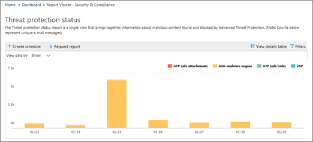

# Create a schedule for a report in the Security &amp; Compliance Center

In the Security &amp; Compliance Center, several [reports and insights](reports-and-insights-in-security-and-compliance.md) are available to help your organization's security team mitigate and address threats to your organization. If you're a member of your organization's security team, you can create a schedule for a report. The schedule you create can include a custom date ranges to suit your organization. 
  
## Create a schedule for a report

> [!IMPORTANT]
> Make sure that you have the necessary permissions to perform this task. In general, Office 365 global administrators, security administrators, and security readers can access reports in the Security &amp; Compliance Center. To learn more about permissions, see [Permissions in the Office 365 Security &amp; Compliance Center](permissions-in-the-security-and-compliance-center.md).
  
1. In the Security &amp; Compliance Center, go to **Reports** \> **Dashboard**.
    
2. Choose a report. For this example, we'll choose the Threat protection status report.
    
3. In the upper left corner of the report, choose **+ Create schedule**.
    
    
  
    The **Create schedule** dialog box opens. 
    
4. Keep the default settings and choose **Create schedule**, or choose **Customize schedule**.
    
    
  
    If you choose to customize your report schedule, you can specify the report's frequency, a sender's email address, and a recipient's email address. 
    
Once you have created a schedule for a report, that report will be delivered via email to recipients' emali addresses automatically. 
  
## Related topics

[Reports and insights in the Office 365 Security &amp; Compliance Center](reports-and-insights-in-security-and-compliance.md)
  
[Manage schedules for reports in the Security &amp; Compliance Center](manage-schedules-for-multiple-reports.md)
  
[Download existing reports in the Security &amp; Compliance Center](download-existing-reports.md)
  
[Download a custom report in the Security &amp; Compliance Center](set-up-and-download-a-custom-report.md)
  

