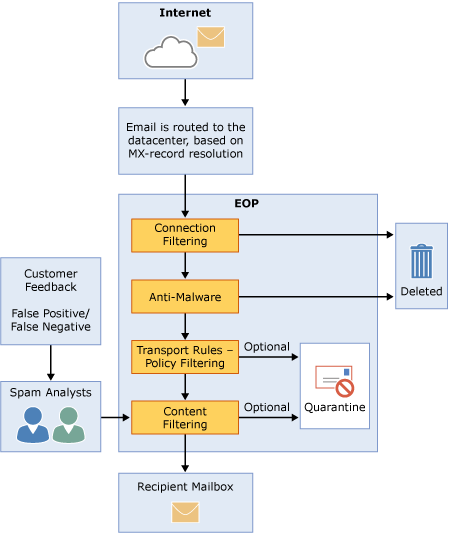

# Exchange Online Protection overview

Microsoft Exchange Online Protection (EOP) is a cloud-based email filtering service that helps protect your organization against spam and malware, and includes features to safeguard your organization from messaging-policy violations. EOP can simplify the management of your messaging environment and alleviate many of the burdens that come with maintaining on-premises hardware and software.
  
The following are the primary ways you can use EOP for messaging protection:
  
- **In a standalone scenario ** EOP provides cloud-based email protection for your on-premises Microsoft Exchange Server 2013 environment, legacy Exchange Server versions, or for any other on-premises SMTP email solution. 
    
- **As a part of Microsoft Exchange Online** By default, EOP protects Microsoft Exchange Online cloud-hosted mailboxes. 
    
- **In a hybrid deployment** EOP can be configured to protect your messaging environment and control mail routing when you have a mix of on-premises and cloud mailboxes. 
    
## How EOP works

To understand how EOP works, it helps to see how it processes incoming email:
  

  
An incoming message initially passes through connection filtering, which checks the sender's reputation and inspects the message for malware. The majority of spam is stopped at this point and deleted by EOP. Messages continue through policy filtering, where messages are evaluated against custom transport rules that you create or enforce from a template. For example, you can have a rule that sends a notification to a manager when mail arrives from a specific sender. (Data loss prevention checks also occur at this point, if you have that feature; for information about feature availability, see the [Exchange Online Protection Service Description](https://go.microsoft.com/fwlink/p/?LinkId=320619).) Next, messages pass through content filtering, where content is checked for terminology or properties common to spam. A message determined to be spam by the content filter can be sent to a user's Junk Email folder or to the quarantine, among other options, based on your settings. After a message passes all of these protection layers successfully, it is delivered to the recipient.
  
### EOP datacenters

EOP runs on a worldwide network of datacenters that are designed to provide the best availability. For example, if a datacenter becomes unavailable, email messages are automatically routed to another datacenter without any interruption in service. Servers in each datacenter accept messages on your behalf, providing a layer of separation between your organization and the Internet, thereby reducing load on your servers. Through this highly available network, Microsoft can ensure that email reaches your organization in a timely manner. 
  
EOP performs load balancing between datacenters but only within a region. If you're provisioned in one region all your messages will be processed using the mail routing for that region. The following list shows the how regional mail routing works for the EOP datacenters:
  
- In the America's, all Exchange Online mailboxes are located in U.S. datacenters, with the exception of Brazil where datacenters in Brazil are used. All email messages, including messages for customers in Brazil, are routed through U.S. datacenters for EOP filtering.
    
- In Europe, the Middle East, and Africa (EMEA), all Exchange Online mailboxes are located in EMEA datacenters, and all messages are routed through EMEA datacenters for EOP filtering.
    
- In Asia-Pacific (APAC), all Exchange Online mailboxes are located in APAC datacenters, but messages are currently routed through EMEA datacenters for EOP filtering. This is targeted to be changing in the fourth quarter of 2014, when messages will be routed through APAC datacenters for EOP filtering.
    
- For the Government Community Cloud (GCC), all Exchange Online mailboxes are located in U.S. datacenters and all messages are routed through U.S. datacenters for EOP filtering.
    
## EOP plans and features

The following are the available EOP subscription plans:
  
- **EOP standalone** Where EOP protects your on-premises mailboxes. 
    
- **EOP features in Exchange Online** Where EOP protects your Exchange Online cloud-hosted mailboxes. 
    
- **Exchange Enterprise CAL with Services** Where EOP protects your on-premises mailboxes, like EOP standalone, and includes data loss prevention (DLP) and reporting using web services. 
    
For information about requirements, important limits, and feature availability across all EOP subscription plans, see the [Exchange Online Protection Service Description](https://go.microsoft.com/fwlink/p/?LinkId=320619).
  
## Setting up EOP

Setting up EOP can be simple, especially in the case of a small organization with a handful of compliance rules. However, if you have a large organization with multiple domains, custom compliance rules, or hybrid mail flow, set up can take more planning and time.
  
If you've already purchased EOP, see [Set up your EOP service](set-up-your-eop-service.md) to ensure that you complete all the steps necessary to configure EOP to protect your messaging environment. 
  
## For more information

[EOP features](eop-features.md)
  
[Videos for getting started with EOP](videos-for-getting-started-with-eop.md)
  
[EOP general FAQ](eop-general-faq.md)
  
[EOP queued, deferred, and bounced messages FAQ](eop-queued-deferred-and-bounced-messages-faq.md)
  
[Delegated administration FAQ](delegated-administration-faq.md)
  
[Move domains and settings from one EOP organization to another EOP organization](move-domains-and-settings-from-one-eop-organization-to-another-eop-organization.md)
  

