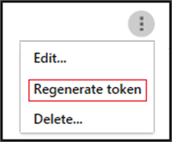
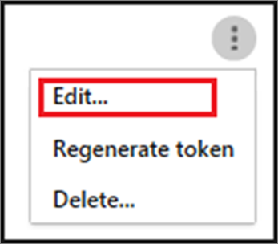
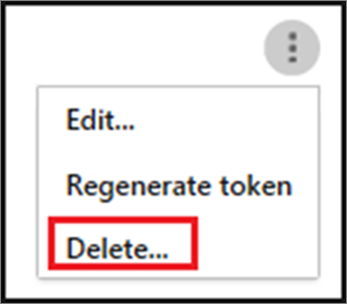

# Integrate your SIEM server with Office 365 Cloud App Security

Office 365 Advanced Security Management is now Office 365 Cloud App Security.
  
|****Evaluation** \>**|****Planning** \>**|****Deployment** \>**|****Utilization****|
|:-----|:-----|:-----|:-----|
|[Start evaluating](office-365-cas-overview.md) <br/> |[Start planning](get-ready-for-office-365-cas.md) <br/> |You are here!  <br/> [Next step](utilization-activities-for-ocas.md) <br/> |[Start utilizing](utilization-activities-for-ocas.md) <br/> |
   
You can integrate [Office 365 Cloud App Security](get-ready-for-office-365-cas.md) with your security information and event management (SIEM) server to enable centralized monitoring of alerts. Integrating with a SIEM service allows you to better protect your Office 365 applications while maintaining your usual security workflow, automating security procedures and correlating between cloud-based and on-premises events. The SIEM agent runs on your server and pulls alerts from Office 365 Cloud App Security and streams them into the SIEM server. 
  
When you first integrate your SIEM with Office 365 Cloud App Security, alerts from the last two days will be forwarded to the SIEM as well as all the alerts from then on (based on the filter you select). Additionally, if you disable this feature for an extended period, when you enable it again it will forward the past two days of alerts and then all alerts from then on.
  
> [!NOTE]
> You must be a global administrator or security administrator to perform the tasks described in this article. See [Permissions in the Office 365 Security &amp; Compliance Center](permissions-in-the-security-and-compliance-center.md). 
  
## SIEM integration architecture

The SIEM agent is deployed in your organization's network. When deployed and configured, it polls the data types that were configured (alerts) using Office 365 Cloud App Security RESTful APIs. The traffic is then sent over an encrypted HTTPS channel on port 443.
  
Once the SIEM agent retrieves the data from Office 365 Cloud App Security, it sends the Syslog messages to your local SIEM using the network configurations you provided during the setup (TCP or UDP with a custom port).
  
## Sample SIEM logs

The logs provided to your SIEM from Microsoft Cloud App Security are CEF over Syslog. In the following sample logs you are able to see the type of event typically sent by Office 365 ASM to your SIEM server. In these you can see when the alert was triggered, the **type of event**, the **policy** that was breached, the **user** who triggered the event, the **app** the user was using when the breach occurred, and the **URL** the alert is coming from: 
  
Sample alerts log:
  
2017-05-12T13:25:57.640Z CEF:0|MCAS|SIEM_Agent|0.97.33|ALERT_CABINET_EVENT_MATCH_AUDIT|asddsddas|3|externalId=5915b7e50d5d72daaf394da9 start=1494595557640 end=1494595557640 msg= **Activity policy 'Mass Download by User'** was triggered by 'admin@contoso.com' **suser=admin@contoso.com** destination **ServiceName=Office 365** cn1Label=riskScore cn1= cs1Label=portal **URL cs1=https://contoso.cloudappsecurity.com** /#/alerts/5915b7e50d5d72daaf394da9 cs2Label=uniqueServiceAppIds cs2=APPID_OFFICE365 cs3Label=relatedAudits cs3=AVv81ljWeXPEqTlM-j-j 
  
## How to integrate

Integrating with your SIEM server is accomplished in three steps:
  
1. Set it up in the Office 365 Cloud App Security portal.
    
2. Download the JAR file and run it on your server.
    
3. Validate that the SIEM agent is working.
    
### Prerequisites

- A standard Windows or Linux server (can be a virtual machine).
    
- The server must be running Java 8; earlier versions are not supported.
    
### Step 1: Set it up in the Office 365 Cloud App Security portal

1. Go to [https://protection.office.com](https://protection.office.com) and sign in using your work or school account for Office 365. (This takes you to the Security &amp; Compliance Center.) 
    
2. Go to **Alerts** \> **Manage advanced alerts**.
    
3. Choose **Go to Office 365 Cloud App Security** to go to the Office 365 Cloud App Security portal. 
    
    
  
4. Click **Settings** \> **SIEM agents**.
    
5. Choose **Add SIEM agent** to start the wizard. 
    
6. In the wizard, choose **Add SIEM agent**.
    
7. In the wizard, specify a name, and **Select your SIEM format** and set any **Advanced settings** that are relevant to that format. Choose **Next**.
    
    
  
8. Type in the IP address or hostname of the **Remote syslog host** and the **Syslog port number**. Select TCP or UDP as the Remote Syslog protocol. You can work with your security admin to get these details if you don't have them. Then choose **Next**.
    
    
  
9. Select the Activities you want to export to your SIEM server. Use the slider to enable and disable them. By default, everything is selected. You can use the **Apply to** drop-down to set filters to send only specific alerts to your SIEM server. You can click **Edit and preview results** to check that the filter works as expected. Click **Next**.
    
    
  
10. Copy the token and save it for later. After you click Finish and leave the Wizard, back in the SIEM page, you can see the SIEM agent you added in the table. It will show that it's **Created** until it's connected later. 
    
### Step 2: Download the JAR file and run it on your server

1. Download the [Microsoft Cloud App Security SIEM Agent](https://go.microsoft.com/fwlink/?linkid=838596) and unzip the folder. 
    
2. Extract the .jar file from the zip file and run it on your server.
    
3. After running the file, run the following: command:
    
  ```
  java -jar mcas-siemagent-0.87.20-signed.jar [--logsDirectory DIRNAME] [--proxy ADDRESS[:PORT]] --token TOKEN
  ```

    > [!NOTE]
    > The file name may differ depending on the version of the SIEM agent.
  
Parameters in brackets [] are optional, and should be used only if relevant.
  
Where the following variables are used:
  
DIRNAME is the path to the directory you want to use for local agent debug logs.
  
ADDRESS[:PORT] is the proxy server address and port that the server uses to connect to the Internet.
  
TOKEN is the SIEM agent token you copied in the previous step.
  
You can type -h at any time to get help. 
  
### Step 3: Validate that the SIEM agent is working
<a name="step3"> </a>

Make sure the status of the SIEM agent in the Office 365 Cloud App Security portal is not **Connection error** or **Disconnected** and there are no agent notifications. 
  

  
- If the connection is down for more than two hours, you will see **Connection error**
    
- If the connection is down for more than 12 hours, you will see **Disconnected**
    
You want to see a status of **Connected**, as shown in the following image:
  

  
In your Syslog/SIEM server, make sure you see alerts arriving from Office 365 Cloud App Security.
  
## Regenerating your token

If you lose your token, you can always regenerate it. In the table, locate the row for the SIEM agent. Click the ellipses, and then choose **Regenerate token**.
  

  
## Editing your SIEM agent

To edit your SIEM agent, in the table, locate the row for the SIEM agent. Click the ellipses, and then choose **Edit**. If you edit the SIEM agent, you do not need to re-run the .jar file; it updates automatically.
  

  
## Deleting your SIEM agent

To delete your SIEM agent, in the table, locate the row for the SIEM agent. Click the ellipses, and then choose **Delete**.
  

  
## Next steps

- [Utilization activities after rolling out Office 365 Cloud App Security](utilization-activities-for-ocas.md)
    
- [Review and take action on alerts](review-office-365-cas-alerts.md)
    
- [Group your IP addresses to simplify management](group-your-ip-addresses-in-ocas.md)
    

