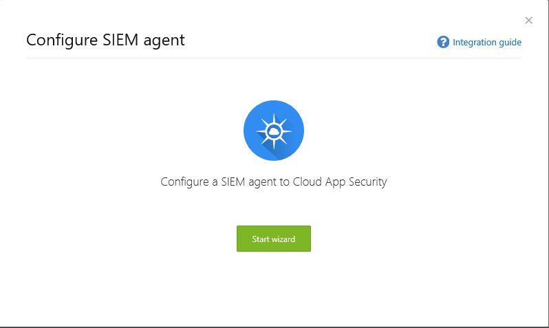
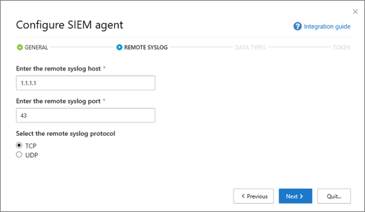
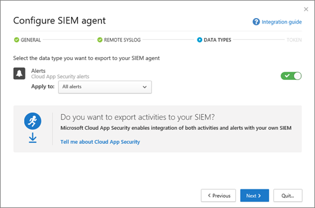

# Integrate your SIEM server with Office 365 Cloud App Security
  
|****Evaluation** \>**|****Planning** \>**|****Deployment** \>**|****Utilization****|
|:-----|:-----|:-----|:-----|
|[Start evaluating](office-365-cas-overview.md) <br/> |[Start planning](get-ready-for-office-365-cas.md) <br/> |You are here!  <br/> [Next step](utilization-activities-for-ocas.md) <br/> |[Start utilizing](utilization-activities-for-ocas.md) <br/> |
   
You can integrate [Office 365 Cloud App Security](get-ready-for-office-365-cas.md) with your security information and event management (SIEM) server to enable centralized monitoring of alerts. This is especially beneficial for organizations who are using cloud services and on-premises server applications. Integrating with a SIEM server allows your security team to better protect your Office 365 applications while maintaining your usual security workflow, by automating certain security procedures and correlating between cloud-based and on-premises events.  
  
When you first integrate your SIEM server with Office 365 Cloud App Security, alerts from the last two days are forwarded to the SIEM server, as well as all alerts from then on (based on any filters you select). Additionally, if you disable this feature for an extended period, when you enable it again, it will forward the past two days of alerts and then all alerts from then on.
  
> [!IMPORTANT]
> .
 
## SIEM integration architecture

A SIEM agent is set up in your organization's network. When deployed and configured, the SIEM agent pulls the data types that were configured (alerts) using Office 365 Cloud App Security RESTful APIs. The traffic is then sent over an encrypted HTTPS channel on port 443.
  
When a SIEM agent retrieves data from Office 365 Cloud App Security, it sends the Syslog messages to your local SIEM server using the network configurations that are provided during setup (TCP or UDP with a custom port).


## Supported SIEM servers

Office 365 Cloud App Security currently supports the following SIEM servers:
- Micro Focus ArcSight
- Generic CEF

## Prerequisites

- You must be a global administrator or security administrator to perform the tasks described in this article. See [Permissions in the Office 365 Security &amp; Compliance Center](permissions-in-the-security-and-compliance-center.md)

- You must have [Office 365 Cloud App Security enabled](turn-on-office-365-cas.md) for your organization.

- [Audit logging](turn-audit-log-search-on-or-off.md) must be turned on for Office 365

- You must have a standard server that meets the following requirements in order to configure SIEM server integration:
    - OS: Windows or Linux (this can be a virtual machine)
    - CPU: 2
    - Disk space: 20 GB
    - RAM: 2 GB
    - [Oracle Java 8](http://www.oracle.com/technetwork/java/javase/downloads/index.html) installed
    - Firewall configured as described in [Network requirements](https://docs.microsoft.com/cloud-app-security/network-requirements)

- You must have details about your **Remote syslog host** and **Syslot port number**. A network administrator or security administrator should be able to help you locate that information. 

- You must agree to [software license terms](https://go.microsoft.com/fwlink/?linkid=862491) to download the [JAR file](https://go.microsoft.com/fwlink/?linkid=838596) you'll need to integrate your SIEM server.
 
## Integrate Office 365 Cloud App Security
    
### Step 1: Set it up in the Office 365 Cloud App Security portal

1. Go to [https://protection.office.com](https://protection.office.com) and sign in using your work or school account for Office 365. (This takes you to the Security &amp; Compliance Center.) 
    
2. Go to **Alerts** \> **Manage advanced alerts**.
    
3. Choose **Go to Office 365 Cloud App Security**. </br>
    
  
4. Click **Settings** \> **Security extensions**.</br>


5. Choose **Add SIEM agent**.</br>
    
6. Choose **Start wizard**.</br> 
    
7. In the **General** step, specify a name, and **Select your SIEM format** and set any **Advanced settings** that are relevant to that format. Then choose **Next**.</br>
    
8. In the **Remote Syslog** step, specify the IP address or hostname of the **Remote syslog host** and the **Syslog port number**. Select TCP or UDP as the Remote Syslog protocol. (You can work with your network administrator or security administrator to get these details if you don't have them.) Then choose **Next**.</br>
  
9. In the **Data Types** step, do one of the following, and then click **Next**:
    - Keep the default setting of **All Alerts**</br>OR
    - Click **All alerts**, and then choose **Specific filters**. Define filters to select the kinds of alerts you want to send to your SIEM server.
</br>
  
10. On the Congratulations screen, copy the token and save it for later.</br> 

> [!IMPORTANT]
> At this point, you have set up a SIEM agent in Office 365 Cloud App Security, but your SIEM server integration is not yet finished. Proceed to the next step to continue your SIEM server integration.

After you click Close and leave the wizard, on the Security extensions screen, you can see the SIEM agent you added in the table. It will show a status of **Created** until it's connected later.


    
### Step 2: Download the JAR file and run it on your server

1. Download the [Microsoft Cloud App Security SIEM Agent](https://go.microsoft.com/fwlink/?linkid=838596) and unzip the folder. (You must agree to [software license terms](https://go.microsoft.com/fwlink/?linkid=862491) in order to proceed.) 
    
2. Extract the .jar file from the zipped folder and run it on your server.
    
3. After running the file, run the following: command:</br>
  ```
  java -jar mcas-siemagent-0.87.20-signed.jar [--logsDirectory DIRNAME] [--proxy ADDRESS[:PORT]] --token TOKEN
  ```
#### Important notes

- The file name may differ depending on the version of the SIEM agent. 

- We recommend that you run the JAR fill on your server during server setup.
    - **Windows**: Run as a scheduled task, making sure to configure the task to **Run whether the user is logged on or not** and clear the **Stop the task if it runs longer than** option.

    - **Linux**: Add the run command with an **&** to the `rc.local` file. </br>Example:</br> 
    ```
    java -jar mcas-siemagent-0.87.20-signed.jar [--logsDirectory DIRNAME] [--proxy ADDRESS[:PORT]] --token TOKEN &
    ```

- Parameters in brackets [] are optional, and should be used only if relevant. Use the following variables:
    - DIRNAME is the path to the directory you want to use for local agent debug logs.
    - ADDRESS[:PORT] is the proxy server address and port that the server uses to connect to the Internet.
    - TOKEN is the SIEM agent token you copied in the first procedure.
    - To get help, type `-h`. 
  
### Step 3: Validate that the SIEM agent is working

1. Make sure the status of the SIEM agent in the Office 365 Cloud App Security portal is not displayed as **Connection error** or **Disconnected** and that there are no agent notifications.</br>For example, here we can see the SIEM server is connected:</br></br>And here, we can see the SIEM server is disconnected:</br> 
  
2. In your Syslog/SIEM server, make sure you see that alerts have arrived from Office 365 Cloud App Security.
  
## Regenerating your token

If you lose your token, you can always regenerate it. In the table, locate the row for the SIEM agent. Click the ellipses, and then choose **Regenerate token**.

  
## Editing your SIEM agent

To edit your SIEM agent, in the table, locate the row for the SIEM agent. Click the ellipses, and then choose **Edit**. If you edit the SIEM agent, you do not need to re-run the .jar file; it updates automatically.

  
## Deleting your SIEM agent

To delete your SIEM agent, in the table, locate the row for the SIEM agent. Click the ellipses, and then choose **Delete**.


## Sample logfiles

Here's an alerts logfile example that might be sent to a SIEM server:

```
2017-07-15T20:42:30.531Z CEF:0|MCAS|SIEM_Agent|0.102.17|ALERT_CABINET_EVENT_MATCH_AUDIT|myPolicy|3|externalId=596a7e360c204203a335a3fb start=1500151350531 end=1500151350531 msg=Activity policy ''myPolicy'' was triggered by ''admin@box-contoso.com'' suser=admin@box-contoso.com destinationServiceName=Box cn1Label=riskScore cn1= cs1Label=portalURL cs1=https://cloud-app-security.com/#/alerts/596a7e360c204203a335a3fb cs2Label=uniqueServiceAppIds cs2=APPID_BOX cs3Label=relatedAudits cs3=1500151288183_acc891bf-33e1-424b-a021-0d4370789660 cs4Label=policyIDs cs4=59f0ab82f797fa0681e9b1c7

2017-07-16T09:36:26.550Z CEF:0|MCAS|SIEM_Agent|0.102.17|ALERT_CABINET_EVENT_MATCH_AUDIT|test-activity-policy|3|externalId=596b339b0c204203a33a51ae start=1500197786550 end=1500197786550 msg=Activity policy ''test-activity-policy'' was triggered by ''user@contoso.com'' suser=user@contoso.com destinationServiceName=Salesforce cn1Label=riskScore cn1= cs1Label=portalURL cs1=https://cloud-app-security.com/#/alerts/596b339b0c204203a33a51ae cs2Label=uniqueServiceAppIds cs2=APPID_SALESFORCE cs3Label=relatedAudits cs3=1500197720691_b7f6317c-b8de-476a-bc8f-dfa570e00349 cs4Label=policyIDs cs4=

2017-07-16T09:17:03.361Z CEF:0|MCAS|SIEM_Agent|0.102.17|ALERT_CABINET_EVENT_MATCH_AUDIT|test-activity-policy3|3|externalId=596b2fd70c204203a33a3eeb start=1500196623361 end=1500196623361 msg=Activity policy ''test-activity-policy3'' was triggered by ''admin@contoso.com'' suser=admin@contoso.com destinationServiceName=Office 365 cn1Label=riskScore cn1= cs1Label=portalURL cs1=https://cloud-app-security.com/#/alerts/596b2fd70c204203a33a3eeb cs2Label=uniqueServiceAppIds cs2=APPID_O365 cs3Label=relatedAudits cs3=1500196549157_a0e01f8a-e29a-43ae-8599-783c1c11597d cs4Label=policyIDs cs4=

2017-07-16T09:17:15.426Z CEF:0|MCAS|SIEM_Agent|0.102.17|ALERT_CABINET_EVENT_MATCH_AUDIT|test-activity-policy|3|externalId=596b2fd70c204203a33a3eec start=1500196635426 end=1500196635426 msg=Activity policy ''test-activity-policy'' was triggered by ''admin@contoso.com'' suser=admin@contoso.com destinationServiceName=Microsoft Office 365 admin center cn1Label=riskScore cn1= cs1Label=portalURL cs1=https://cloud-app-security.com/#/alerts/596b2fd70c204203a33a3eec cs2Label=uniqueServiceAppIds cs2=APPID_O365_PORTAL cs3Label=relatedAudits cs3=1500196557398_3e102b20-d9fa-4f66-b550-8c7a403bb4d8 cs4Label=policyIDs cs4=59f0ab35f797fa9811e9b1c7

2017-07-16T09:17:46.290Z CEF:0|MCAS|SIEM_Agent|0.102.17|ALERT_CABINET_EVENT_MATCH_AUDIT|test-activity-policy4|3|externalId=596b30200c204203a33a4765 start=1500196666290 end=1500196666290 msg=Activity policy ''test-activity-policy4'' was triggered by ''admin@contoso.com'' suser=admin@contoso.com destinationServiceName=Microsoft Exchange Online cn1Label=riskScore cn1= cs1Label=portalURL cs1=https://cloud-app-security.com/#/alerts/596b30200c204203a33a4765 cs2Label=uniqueServiceAppIds cs2=APPID_OUTLOOK cs3Label=relatedAudits cs3=1500196587034_a8673602-7e95-46d6-a1fe-c156c4709c5d cs4Label=policyIDs cs4=

2017-07-16T09:41:04.369Z CEF:0|MCAS|SIEM_Agent|0.102.17|ALERT_CABINET_EVENT_MATCH_AUDIT|test-activity-policy2|3|externalId=596b34b10c204203a33a5240 start=1500198064369 end=1500198064369 msg=Activity policy ''test-activity-policy2'' was triggered by ''user2@test15-adallom.com'' suser=user2@test15-adallom.com destinationServiceName=Google cn1Label=riskScore cn1= cs1Label=portalURL cs1=https://cloud-app-security.com/#/alerts/596b34b10c204203a33a5240 cs2Label=uniqueServiceAppIds cs2=APPID_33626 cs3Label=relatedAudits cs3=1500197996117_fd71f265-1e46-4f04-b372-2e32ec874cd3 cs4Label=policyIDs cs4=
```

And here's a sample in CEF format


|CEF field name  | Description  |
|---------|---------|
|start     | alert timestamp        |
|end     | alert timestamp        |
|rt     | alert timestamp        |
|msg     | alert description as shown in the Office 365 Cloud App Security portal        |
|suser     | alert subject user        |
|destinationServiceName     | alert originating app, such as Office 365, SharePoint, or OneDrive        |
|csLabel     | Varies (labels have different meanings). Typically, labels are self-explanatory, like targetObjects.        |
|cs     | Information corresponding to a label (such as the target user of an alert as per the label example)        |
  
## Next steps

- [Utilization activities after rolling out Office 365 Cloud App Security](utilization-activities-for-ocas.md)
    
- [Review and take action on alerts](review-office-365-cas-alerts.md)
    
- [Group your IP addresses to simplify management](group-your-ip-addresses-in-ocas.md)
    

