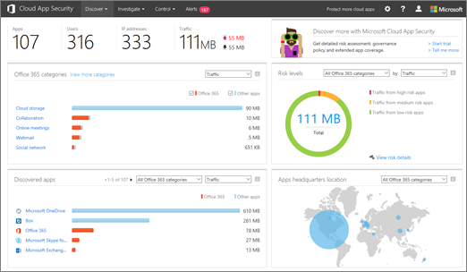

# Overview of Office 365 Cloud App Security

Office 365 Advanced Security Management is now Office 365 Cloud App Security.
  
|****Evaluation** \>**|****Planning** \>**|****Deployment** \>**|****Utilization****|
|:-----|:-----|:-----|:-----|
|You are here!    [Next step](get-ready-for-office-365-cas.md)   |[Start planning](get-ready-for-office-365-cas.md)   |[Start deploying](turn-on-office-365-cas.md)   |[Start utilizing](utilization-activities-for-ocas.md)   |
   
> [!NOTE]
> Office 365 Cloud App Security is available in Office 365 Enterprise E5. If your organization is using another Office 365 Enterprise subscription, Office 365 Cloud App Security can be purchased as an add-on. (As a global administrator, in the Office 365 admin center, choose **Billing** \> **Add subscriptions**.) For more information, see [Office 365 Platform Service Description: Office 365 Security &amp; Compliance Center](https://technet.microsoft.com/en-us/library/dn933793.aspx) and [Buy or edit an add-on for Office 365 for business](https://support.office.com/article/4e7b57d6-b93b-457d-aecd-0ea58bff07a6). 
  
Office 365 Cloud App Security gives you insight into suspicious activity in Office 365 so you can investigate situations that are potentially problematic and, if needed, take action to address security issues. With Office 365 Cloud App Security, you can receive notifications of triggered alerts for atypical or suspicious activities, see how your organization's data in Office 365 is accessed and used, suspend user accounts exhibiting suspicious activity, and require users to log back in to Office 365 apps after an alert has been triggered. Read this article to get an overview of Office 365 Cloud App Security features and capabilities.
  
    
## How to find the Office 365 Cloud App Security portal

> [!NOTE]
> To access the Office 365 Cloud App Security portal, you must be a global administrator, security administrator, or security reader. To learn more, see [Permissions in the Office 365 Security &amp; Compliance Center](permissions-in-the-security-and-compliance-center.md). 
  
You can get to the Office 365 Cloud App Security portal through the Office 365 Security &amp; Compliance Center. Here's one good way to do it:
  
1. Go to [https://protection.office.com](https://protection.office.com) and sign in using your work or school account for Office 365. (This takes you to the Security &amp; Compliance Center.) 
    
2. In the Security &amp; Compliance Center, choose **Alerts** \> **Manage advanced alerts**. 
    
    
  
    (If Office 365 Cloud App Security is not yet enabled, and you are a global administrator, [turn on Office 365 Cloud App Security](turn-on-office-365-cas.md).)
    
3. Choose **Go to Office 365 Cloud App Security**. 
    
## Policies

Office 365 Cloud App Security works with the policies that are defined for your organization. With Office 365 Cloud App Security, your organization gets 10 predefined anomaly detection policies and several templates for activity policies. These policies are designed to detect general anomalies, identify users logging in from a risky IP address, detect ransomware activities, detect administrator activities from non-corporate IP addresses, and more.
  

  
To view/use policy templates, in the Office 365 Cloud App Security portal, go to **Control** \> **Templates**. 
  

  
To learn more about policies, see the following resources:
  
- [Activity policies and alerts in Office 365 Cloud App Security](activity-policies-and-alertsc.md)
    
- [Anomaly detection policies in Office 365 Cloud App Security](anomaly-detection-policies-in-ocas.md)
    
## Alerts

When policies are defined, alerts notify you about suspicious or atypical activities that were detected. To view alerts for your organization, choose **Alerts** in the navigation bar across the top of the screen. 
  

  
As alerts are triggered you can review them to learn more about what is going on. Then, if the activity is still suspicious, you can take action. For example, you can notify a user about an issue, suspend a user from signing in to Office 365, or require a user to sign back in to Office 365 apps.
  
To learn more about alerts, see the following resources:
  
- [Activity policies and alerts in Office 365 Cloud App Security](activity-policies-and-alertsc.md)
    
- [Anomaly detection policies in Office 365 Cloud App Security](anomaly-detection-policies-in-ocas.md)
    
- [Review and take action on Office 365 Cloud App Security alerts](review-office-365-cas-alerts.md)
    
## Activity logs

View information about user activities on your Activity log page in Office 365 Cloud App Security.
  

  
To get to this page, in the Office 365 Cloud App Security portal, go to **Investigate** \> **Activity log**. 
  

  
You can use your web traffic logs with Office 365 Cloud App Security, too. The more details that are included in those log files, the better visibility you'll have into user activity. You can use log files from Barracuda, Blue Coat, Check Point, Cisco, Clavister, Dell SonicWALL, Fortinet, Juniper, McAfee, Microsoft, Palo Alto, Sophos, Squid, Websence, Zscaler, and more.
  
[Learn about web traffic logs and data sources for Office 365 Cloud App Security](web-traffic-logs-and-data-sources-for-ocas.md)
  
## App permissions

With Office 365 Cloud App Security, you can allow or prevent people in your organization to use third-party apps that access data in Office 365.
  

  
To get to this page, go to **Investigate** \> **App permissions**. 
  

  
[Manage app permissions using Office 365 Cloud App Security](manage-app-permissions-in-ocas.md)
  
## Cloud Discovery Dashboard

The **Cloud Discovery Dashboard**, also referred to as **Productivity App Discovery**, shows information about cloud app usage within your organization. You can view information about apps, users, traffic, transactions, and more using this dashboard. The Cloud Discovery Dashboard resembles the following image: 
  

  
To get to this dashboard, in the Office 365 Cloud App Security portal, go to **Discover** \> **Cloud Discovery dashboard**. 
  

  
[Review app discovery findings in Office 365 Cloud App Security](review-app-discovery-findings-in-ocas.md)
  
## Next steps

- Get the [Office 365 Cloud App Security Use Cases and Usage Guide](https://aka.ms/O365CASGuide)
    
- [Get ready for Office 365 Cloud App Security](get-ready-for-office-365-cas.md)
    

