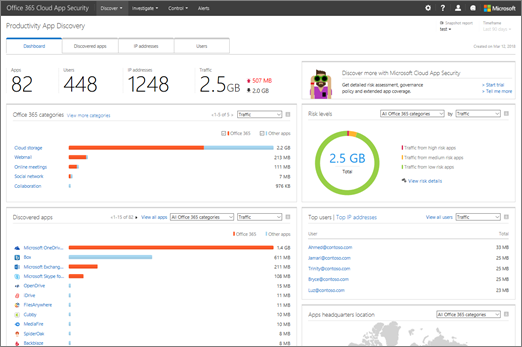

# Review app discovery findings in Office 365 Cloud App Security

Office 365 Advanced Security Management is now Office 365 Cloud App Security.
  
|****Evaluation** \>**|****Planning** \>**|****Deployment** \>**|****Utilization****|
|:-----|:-----|:-----|:-----|
|[Start evaluating](office-365-cas-overview.md)   |[Start planning](get-ready-for-office-365-cas.md)   |[Start deploying](turn-on-office-365-cas.md)   |You are here!    [Next steps](review-app-discovery-findings-in-ocas.md#nextsteps)   |
   
The Cloud Discovery dashboard works with your organization's web traffic logs to provide detailed information about cloud app usage. If you're a global administrator, security administrator, or security reader, and your organization has [created app discovery reports in Office 365 Cloud App Security](create-app-discovery-reports-in-ocas.md), you can use the Cloud Discovery dashboard to gain insight into how people in your organization are using Office 365 and other cloud apps. (The Cloud Discovery dashboard is also known as Productivity App Discovery.)
  
 **As of March 2018, the Cloud Discovery dashboard has new features** that make it easier to view detailed information about how people in your organization are using Office 365 and other apps. 
  

  
 **In this article**: 
  
- [Go to the Cloud Discovery dashboard](review-app-discovery-findings-in-ocas.md#gotodash)
    
- [See your top users, IP addresses, apps, and risk levels](review-app-discovery-findings-in-ocas.md#reviewdash)
    
- [Dive deeper into the information](review-app-discovery-findings-in-ocas.md#divedeeper)
    
- [Exclude entities](review-app-discovery-findings-in-ocas.md#excludeentities)
    
- [Next steps](review-app-discovery-findings-in-ocas.md#nextsteps)
    
## Go to the Cloud Discovery dashboard

1. Go to [https://protection.office.com](https://protection.office.com) and sign in using your work or school account for Office 365. (This takes you to the Security &amp; Compliance Center.) 
    
2. In the Security &amp; Compliance Center, choose **Alerts** \> **Manage advanced alerts**.
    
    (If Office 365 Cloud App Security is not yet enabled, and you are a global administrator, [turn on Office 365 Cloud App Security](turn-on-office-365-cas.md).)
    
3. Choose **Go to Office 365 Cloud App Security**.
    
4. Go to **Discover** \> **Cloud Discovery dashboard**.
    
## See your top users, IP addresses, apps, and risk levels

The Cloud Discovery dashboard gives you an at-a-glance overview of apps that are used with Office 365 in your organization, any open alerts, top users, and risk levels.
  

  
1. On the **Dashboard** tab, look at the overall cloud app use in your organization in the overview section across the top of the screen. 
    
2. See the **Office 365 categories** for apps that are used in your organization. 
    
3. Look at the **Discovered apps** widget to see usage of Office 365 and other apps in this view. 
    
4. Look at the **Top users** and **Top IP addresses** widget to identify those who use Office 365 and cloud apps the most in your organization. 
    
5. See where the apps people are using are by geographical location by using the **Apps headquarters location** map. 
    
6. Above the maps area, take a look at the risk score of the discovered apps in the **Risk levels** overview. You can look at risks by the same groups and categories that you used in the **Discovered apps** area. For example, you can see how much traffic in each grouping is from high, medium, or low risk apps. 
    
## Dive deeper into the information

You can use Cloud Discovery to take a deeper look at apps, subdomains, IP addresses, and users.
  
1. In the Cloud Discovery dashboard, choose the **Discovered apps** tab. 
    
2. Use the filters section to view apps by name, category, usage level, or last seen date.
    
3. In the list of results, hover by an app name to reveal the **View sub-domains** link. 
    
    
  
    Detailed information about the selected app will appear.
    
4. To view details about IP addresses, choose the **IP addresses** tab. 
    
    
  
    In the list of results, select an individual IP address to view more detailed information.
    
5. To view details about Office 365 users within your organization, choose the **Users** tab. 
    
    
  
## Exclude entities

You can exclude certain system users or IP addresses in order to focus on more specific information.
  
1. Choose **Settings** \> **Cloud Discovery settings**.
    
2. Choose **Exclude entities**.
    
3. Choose either **Excluded users** or **Excluded IP addresses**.
    
4. Specify the users or IP addresses, and in the **Comments** box, type information about why you are excluding those users or IP addresses. 
    
5. Choose **Add**.
    
## Next steps

- [Review and take action on alerts](review-office-365-cas-alerts.md)
    
- [Create app discovery reports](create-app-discovery-reports-in-ocas.md)
    
- Review your [utilization activities for Office 365 Cloud App Security](utilization-activities-for-ocas.md)
    

