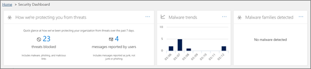
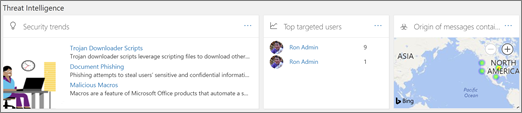
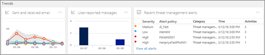

# Security dashboard overview

The Security &amp; Compliance Center enables your organization to manage data protection and compliance. Beginning in March 2018, the Security &amp; Compliance Center features a new Security Dashboard you can use to review your threat protection status, and view and act on security alerts. 
  
Watch the video to get an overview, and then read this article to learn more.
  
> [!VIDEO https://www.microsoft.com/videoplayer/embed/3540b1f8-62d2-47fa-a07d-d7ad76f55b0f?autoplay=false]
  
Depending on what your organization's Office 365 subscription includes, the Security Dashboard includes the following sections:
  
- [Threat protection status](#threat-protection-status)
    
- [Insights](#insights)
    
- [Threat intelligence](#threat-intelligence)
    
- [Trends](#trends)
    
To view the Security Dashboard, in the [Office 365 Security &amp; Compliance Center](go-to-the-securitycompliance-center.md), go to **Threat management** \> **Dashboard**.
  
> [!NOTE]
> You must be an Office 365 global administrator, security administrator, or security reader to view the Security Dashboard. See [Permissions in the Office 365 Security &amp; Compliance Center](permissions-in-the-security-and-compliance-center.md). 
  
## Threat protection status

In the upper left corner of the Security Dashboard is a threat protection status widget that shows threat protection effectiveness. This widget tells you at a glance how many threats were blocked by [Office 365 Exchange Online Protection](anti-spam-protection.md) and [Office 365 Advanced Threat Protection](office-365-atp.md) (if configured) over the last seven days. This widget also shows the number of email messages detected as misclassified and reported by using the [Use the Report Message add-in](https://support.office.com/article/b5caa9f1-cdf3-4443-af8c-ff724ea719d2). Review your anti-spam, anti-malware, and anti-phishing policies to improve your configuration.
  

  
In addition, Malware reports can be used to track recent trends in malicious content targeted at your organization. Click a tile to view more information in the report.
  
## Insights

Insights not only surface key issues you should review, they also include recommendations and actions to consider. For example, you might see that phishing email messages are being delivered because some users have disabled their junk mail options. To learn more about how insights work, see [Reports and insights in the Office 365 Security &amp; Compliance Center](reports-and-insights-in-security-and-compliance.md).
  
## Threat intelligence

If your organization has [Office 365 Threat Intelligence](office-365-ti.md), your Security Dashboard has a **Threat Intelligence** section that includes advanced tools. Your organization's security team can use the information in this section to understand emerging campaigns, investigate threats and manage incidents. 
  

  
> [!TIP]
> Office 365 Threat Intelligence is included with Office 365 Enterprise E5; however, if your organization is using another Office 365 Enterprise subscription, Office 365 Threat Intelligence can be purchased as an add-on. For more information, see [Office 365 Threat Intelligence](office-365-ti.md). 
  
## Trends

Near the bottom of the Security Dashboard is a **Trends** section, which summarizes email flow trends for your organization. Reports provide information about email categorized as spam, malware, phishing attempts, and good email. Click a tile to view more detailed information in the report. 
  

  
And, if your organization's Office 365 subscription includes [Office 365 Threat Intelligence](office-365-ti.md), you will also have a **Recent threat management alerts** report in this section that enables your security team to view and take action on high-priority security alerts. 
  
## Related topics

[View email security reports in the Security &amp; Compliance Center](view-email-security-reports.md)
  
[View reports for Office 365 Advanced Threat Protection](view-reports-for-atp.md)
  
[Office 365 Advanced Threat Protection](office-365-atp.md)
  
[Office 365 Threat Intelligence](office-365-ti.md)
  

