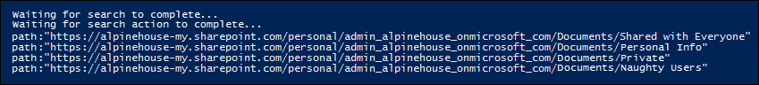

# Use Content Search in Office 365 for targeted collections

The Content Search feature in the Office 365 Security &amp; Compliance Center doesn't provide a direct way in the UI to search specific folders in Exchange mailboxes or SharePoint and OneDrive for Business sites. However, it is possible to search specific folders (called a targeted collection) by specifying the folder ID or path in the actual search query syntax. Using Content Search to perform a targeted collection is useful when you're confident that items responsive to a case or privileged items are located in a specific mailbox or site folder. You can use the script in this article to obtain the folder ID for mailbox folders or the path for folders on a SharePoint and OneDrive for Business site. Then you can use the folder ID or path in a search query to return items located in the folder.
  
## Before you begin

- You have to be a member of the eDiscovery Manager role group in the Security &amp; Compliance Center to run the script in Step 1. For more information, see [Assign eDiscovery permissions in the Office‍ 365 Security &amp; Compliance Center](assign-ediscovery-permissions.md).
    
    Additionally, you have to be assigned the Mail Recipients role in your Exchange Online organization. This is required to run the **Get-MailboxFolderStatistics** cmdlet, which is included in the script in Step 1. By default, the Mail Recipients role is assigned to the Organization Management and Recipient Management role groups in Exchange Online. For more information about assigning permissions in Exchange Online, see [Manage role group members](https://go.microsoft.com/fwlink/p/?linkid=692102). You could also create a custom role group, assign the Mail Recipients role to it, and then add the members who need to run the script in Step 1. For more information, see [Manage role groups](https://go.microsoft.com/fwlink/p/?linkid=730688).
    
- Each time you run the script in Step 1, a new remote PowerShell session is created. So you could use up all the remote PowerShell sessions available to you. To prevent this from happening, you can run the following command to disconnect your active remote PowerShell sessions.
    
  ```
  Get-PSSession | Remove-PSSession
  ```

    For more information, see [Connect to Exchange Online PowerShell](https://go.microsoft.com/fwlink/p/?linkid=396554).
    
- The script includes minimal error handling. The primary purpose of the script is to quickly display a list of mailbox folder IDs or site paths that can be used in the search query syntax of a Content Search to perform a targeted collection.
    
- The sample script provided in this topic isn't supported under any Microsoft standard support program or service. The sample script is provided AS IS without warranty of any kind. Microsoft further disclaims all implied warranties including, without limitation, any implied warranties of merchantability or of fitness for a particular purpose. The entire risk arising out of the use or performance of the sample script and documentation remains with you. In no event shall Microsoft, its authors, or anyone else involved in the creation, production, or delivery of the scripts be liable for any damages whatsoever (including, without limitation, damages for loss of business profits, business interruption, loss of business information, or other pecuniary loss) arising out of the use of or inability to use the sample scripts or documentation, even if Microsoft has been advised of the possibility of such damages.
  
## Step 1: Run the script to get a list of folders for a mailbox or site

The script that you run in this first step will return a list of mailbox folders or SharePoint or OneDrive for Business folders, and the corresponding folder ID or path for each folder. When you run this script, it will prompt you for the following information.
  
- **Email address or site URL** Type an email address of the custodian to return a list of Exchange mailbox folders and fold IDs. Or type the URL for a SharePoint site or a OneDrive for Business site to return a list of paths for the specified site. Here are some examples: 
    
  - **Exchange** - stacig@contoso.onmicrosoft.com 
    
  - **SharePoint** - https://contoso.sharepoint.com/sites/marketing 
    
  - **OneDrive for Business** - https://contoso-my.sharepoint.com/personal/stacig_contoso_onmicrosoft_com 
    
- **Your user credentials** - The script will use your credentials to connect to Exchange Online and the Security &amp; Compliance Center with remote PowerShell. As previously explained, you have to assigned the appropriate permissions to successfully run this script.
    
To display a list of mailbox folders or site path names:
  
1. Save the following text to a Windows PowerShell script file by using a filename suffix of .ps1; for example, `GetFolderSearchParameters.ps1`.
    
  ```
  #########################################################################################################
  # This PowerShell script will prompt you for:								#
  #    * Admin credentials for a user who can run the Get-MailboxFolderStatistics cmdlet in Exchange	#
  #      Online and who is an eDiscovery Manager in the Security &amp; Compliance Center.			#
  # The script will then:											#
  #    * If an email address is supplied: list the folders for the target mailbox.			#
  #    * If a SharePoint or OneDrive for Business site is supplied: list the folder paths for the site.	#
  #    * In both cases, the script supplies the correct search properties (folderid: or path:)		#
  #      appeneded to the folder ID or path ID to use in a Content Search.				#
  # Notes:												#
  #    * For SharePoint and OneDrive for Business, the paths are searched recursively; this means the 	#
  #      the current folder and all sub-folders are searched.						#
  #    * For Exchange, only the specified folder will be searched; this means sub-folders in the folder	#
  #      will not be searched.  To search sub-folders, you need to use the specify the folder ID for	#
  #      each sub-folder that you want to search.								#
  #    * For Exchange, only folders in the user's primary mailbox will be returned by the script.		#
  #########################################################################################################
  # Collect the target email address or SharePoint Url
  $addressOrSite = Read-Host "Enter an email address or a URL for a SharePoint or OneDrive for Business site"
  # Authenticate with Exchange Online and the Security &amp; Complaince Center (Exchange Online Protection - EOP)
  if (!$credentials)
  {
      $credentials = Get-Credential
  }
  if ($addressOrSite.IndexOf("@") -ige 0)
  {
      # List the folder Ids for the target mailbox
      $emailAddress = $addressOrSite
      # Authenticate with Exchange Online
      if (!$ExoSession)
      {
          $ExoSession = New-PSSession -ConfigurationName Microsoft.Exchange -ConnectionUri https://ps.outlook.com/powershell-liveid/ -Credential $credentials -Authentication Basic -AllowRedirection
          Import-PSSession $ExoSession -AllowClobber -DisableNameChecking
      }
      $folderQueries = @()
      $folderStatistics = Get-MailboxFolderStatistics $emailAddress
      foreach ($folderStatistic in $folderStatistics)
      {
          $folderId = $folderStatistic.FolderId;
          $folderPath = $folderStatistic.FolderPath;
          $encoding= [System.Text.Encoding]::GetEncoding("us-ascii")
          $nibbler= $encoding.GetBytes("0123456789ABCDEF");
          $folderIdBytes = [Convert]::FromBase64String($folderId);
          $indexIdBytes = New-Object byte[] 48;
          $indexIdIdx=0;
          $folderIdBytes | select -skip 23 -First 24 | %{$indexIdBytes[$indexIdIdx++]=$nibbler[$_ -shr 4];$indexIdBytes[$indexIdIdx++]=$nibbler[$_ -band 0xF]}
          $folderQuery = "folderid:$($encoding.GetString($indexIdBytes))";
          $folderStat = New-Object PSObject
          Add-Member -InputObject $folderStat -MemberType NoteProperty -Name FolderPath -Value $folderPath
          Add-Member -InputObject $folderStat -MemberType NoteProperty -Name FolderQuery -Value $folderQuery
          $folderQueries += $folderStat
      }
      Write-Host "-----Exchange Folders-----"
      $folderQueries |ft
  }
  elseif ($addressOrSite.IndexOf("http") -ige 0)
  {
      $searchName = "SPFoldersSearch"
      $searchActionName = "SPFoldersSearch_Preview"
      # List the folders for the SharePoint or OneDrive for Business Site
      $siteUrl = $addressOrSite
      # Authenticate with the Security &amp; Complaince Center
      if (!$SccSession)
      {
          $SccSession = New-PSSession -ConfigurationName Microsoft.Exchange -ConnectionUri https://ps.compliance.protection.outlook.com/powershell-liveid -Credential $credentials -Authentication Basic -AllowRedirection
          Import-PSSession $SccSession -AllowClobber -DisableNameChecking
      }
      # Clean-up, if the the script was aborted, the search we created might not have been deleted.  Try to do so now.
      Remove-ComplianceSearch $searchName -Confirm:$false -ErrorAction 'SilentlyContinue'
      # Create a Content Search against the SharePoint Site or OneDrive for Business site and only search for folders; wait for the search to complete
      $complianceSearch = New-ComplianceSearch -Name $searchName -ContentMatchQuery "contenttype:folder" -SharePointLocation $siteUrl
      Start-ComplianceSearch $searchName
      do{
          Write-host "Waiting for search to complete..."
          Start-Sleep -s 5
          $complianceSearch = Get-ComplianceSearch $searchName
      }while ($complianceSearch.Status -ne 'Completed')
      if ($complianceSearch.Items -gt 0)
      {
          # Create a Complinace Search Action and wait for it to complete. The folders will be listed in the .Results parameter
          $complianceSearchAction = New-ComplianceSearchAction -SearchName $searchName -Preview
          do
          {
              Write-host "Waiting for search action to complete..."
              Start-Sleep -s 5
              $complianceSearchAction = Get-ComplianceSearchAction $searchActionName
          }while ($complianceSearchAction.Status -ne 'Completed')
          # Get the results and print out the folders
          $results = $complianceSearchAction.Results
          $matches = Select-String "Data Link:.+[,}]" -Input $results -AllMatches
          foreach ($match in $matches.Matches)
          {
              $rawUrl = $match.Value
              $rawUrl = $rawUrl -replace "Data Link: " -replace "," -replace "}"
              Write-Host "path:""$rawUrl"""
          }
      }
      else
      {
          Write-Host "No folders were found for $siteUrl"
      }
      Remove-ComplianceSearch $searchName -Confirm:$false -ErrorAction 'SilentlyContinue'
  }
  else
  {
      Write-Error "Couldn't recognize $addressOrSite as an email address or a site URL"
  }
  ```

2. On your local computer, open Windows PowerShell and go to the folder where you saved the script.
    
3. Run the script; for example:
    
      ```
      .\GetFolderSearchParameters.ps1
      ```

4. Enter the information that the script prompts you for.
    
    The script displays a list of mailbox folders or site folder for the specified user. Let this window open so that you can copy a folder ID or path name and paste it in to a search query in Step 2.
    
    > [!TIP]
    > Instead of displaying a list of folders on the computer screen, you can re-direct the output of the script to a text file. This file will be saved to the folder where the script is located. For example, to redirect the script output to a text file, run the following command in Step 3:  `.\GetFolderSearchParameters.ps1 > StacigFolderIds.txt` Then you can copy a folder ID or path from the file to use in a search query.
  
### Script output for mailbox folders

If you're getting mailbox folder IDs, the script connects to Exchange Online by using remote PowerShell, runs the **Get-MailboxFolderStatisics** cmdlet, and then displays the list of the folders from the specified mailbox. For every folder in the mailbox, the script displays the name of the folder in the **FolderPath** column and the folder ID in the **FolderQuery** column. Additionally, the script adds the prefix of **folderId** (which is the name of the mailbox property) to the folder ID. Because the **folderid** property is a searchable property, you'll use  `folderid:<folderid>` in a search query in Step 2 to search that folder. 
  
Here's an example of the output returned by the script for mailbox folders.
  

  
The example in Step 2 shows the query used to search the Purges subfolder in the user's Recoverable Items folder.
  
### Script output for site folders

If you're getting paths from SharePoint or OneDrive for Business sites, the script connects to the Security &amp; Compliance Center using remote PowerShell, creates a new Content Search that searches the site for folders, and then displays a list of the folders located in the specified site. The script displays the name of each folder and adds the prefix of **path** (which is the name of the site property) to the folder URL. Because the **path** property is a searchable property, you'll use  `path:<path>` in a search query in Step 2 to search that folder. 
  
Here's an example of the output returned by the script for site folders.
  

  
## Step 2: Use a folder ID or path to perform a targeted collection

After you've run the script to collect a list of folder IDs or paths for a specific user, the next step to go to the Security &amp; Compliance Center and create a new Content Search to search a specific folder. You'll use the  `folderid:<folderid>` or  `path:<path>` property in the search query that you configure in the Content Search keyword box (or as the value for the  *ContentMatchQuery*  parameter if you use the **New-ComplianceSearch** cmdlet). You can combine the  `folderid` or  `path` property with other search parameters or search conditions. If you only include the  `folderid` or  `path` property in the query, the search will return all items located in the specified folder. 
  
> [!NOTE]
> Using the  `path` property to search OneDrive locations won't return media files, such as .png, .tiff, or .wav files, in the search results. 
  
1. Go to [https://protection.office.com](https://protection.office.com).
    
2. Sign in to Office 365 using the account and credentials that you used to run the script in Step 1.
    
3. In the left pane of the Security &amp; Compliance Center, click **Search &amp; investigation** \> **Content search**, and then click **New** .
    
4. On the **New search** page, type a name for the Content Search. This name has to be unique in your organization. 
    
5. Under **Where do you want us to look**, do one of the following, based on whether your searching a mailbox folder or a site folder:
    
    - Click **Choose specific mailboxes to search** and then add the same mailbox that you specified when you ran the script in Step 1. 
    
      Or
    
    - Click **Choose specific sites to search** to search and then add the same site URL that you specified when you ran the script in Step 1. 
    
6. Click **Next**.
    
7. In the keyword box on the **What do you want us to look for** page, paste the  `folderid:<folderid>` or  `path:<path>` value that was returned by the script in Step 1. 
    
    For example, the query in the following screenshot will search for any item in the Purges subfolder in the user's Recoverable Items folder (the value of the `folderid` property for the Purges subfolder is shown in the screenshot in Step 1):
    
    
  
8. Click **Search** to start the targeted collection search. 
  
### Examples of search queries for targeted collections

Here are some examples of using the  `folderid` and  `path` properties in a search query to perform a targeted collection. Note that placeholders are used for  `folderid:<folderid>` and  `path:<path>` to save space. 
  
- This example searches three different mailbox folders. You could use similar query syntax to search the hidden folders in a user's Recoverable Items folder.
    
  ```
  folderid:<folderid> OR folderid:<folderid> OR folderid:<folderid>
  ```

- This example searches a mailbox folder for items that contain an exact phrase.
    
  ```
  folderid:<folderid> AND "Contoso financial results"
  ```

- This example searches a site folder (and any subfolders) for documents that contain the letters "NDA" in the title.
    
  ```
  path:<path> AND filename:nda
  ```

- This example searches a site folder (and any subfolder) for documents there were changed within a date range.
    
  ```
  path:<path> AND (lastmodifiedtime>=01/01/2017 AND lastmodifiedtime<=01/21/2017)
  ```
  
## More information

Keep the following things in mind when using the script in this article and performing targeted collections.
  
- The script doesn't remove any folders from the results. So some folders listed in the results might be unsearchable (or return zero items) because they contain system-generated content.
    
- This script only returns folder information for the user's primary mailbox. It doesn't return information about folders in the user's archive mailbox.
    
- When searching mailbox folders, only the specified folder (identified by its  `folderid` property) will be searched. Subfolders won't be searched. To search sub-folders, you need to use the  `folderid` for the sub-folder that you want to search. 
    
- When searching site folders, the folder (identified by its  `path` property) and all sub-folders will be searched. 
    
- As previously stated, you can't use  `path` property to search for media files, such as .png, .tiff, or .wav files, located in OneDrive locations. Use a different [site property](keyword-queries-and-search-conditions.md#searchable-site-properties) to search for media files in OneDrive folders. 
