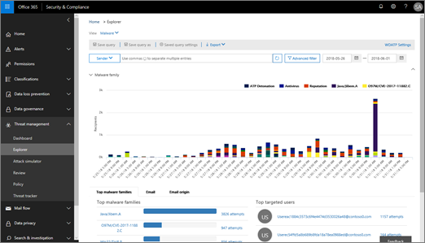
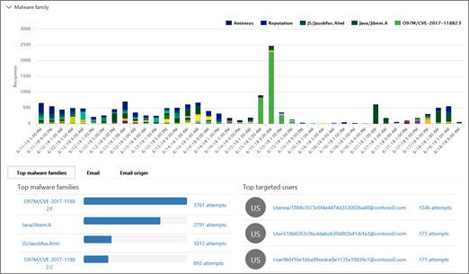
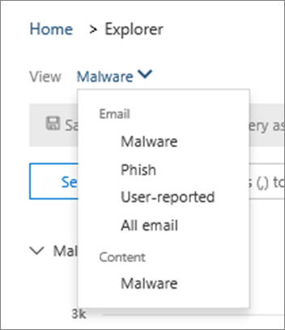
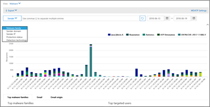
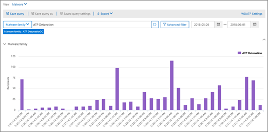
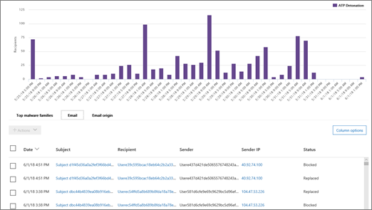

# Use Explorer in the Security &amp; Compliance Center

If your organization has [Office 365 Threat Intelligence](office-365-ti.md), and you have the necessary [permissions in the Office 365 Security and Compliance Center](permissions-in-the-security-and-compliance-center.md), you can use Explorer to identify and analyze threats. For example, you can identify and delete malicious email that was delivered, or see malware that was caught by Office 365 security features. Explorer (also referred to as Threat Explorer) is a powerful near real-time report in the Security &amp; Compliance Center.
  

  
To use Explorer, in the Security &amp; Compliance Center, go to **Threat management** \> **Explorer**.
      
## Explorer overview

Explorer displays information about suspected malware in email and files in Office 365, as well as other security threats and risks to your organization. When you first open Explorer, the default view shows malware detections from antivirus. Explorer can also show security protection features in Office 365, including [Safe Links](atp-safe-links.md) and [Safe Attachments](atp-safe-attachments.md).
  

  
Use the View menu to change what information is displayed.
  

  
Explorer has several filtering and querying capabilities that enable you to drill into details, such as top targeted users, top malware families, and more. Each kind of report offers a variety of ways to view and explore data, as described in the following table.
  
|**Choose this option**|**To view this data**|
|:-----|:-----|
|**Email** \> **Malware**   |Email messages identified as containing malware.    View information in the chart by malware family, sender domain, sender IP, protection status (actions taken by your threat protection features and policies in Office 365), and detection technology (how the malware was detected).                 Below the chart, view details about top malware families, top targeted users, and more details about specific messages.    |
|**Email** \> **Phish**   |Email messages identified as phishing attempts.    View information by sender domain, sender IP, and protection status (actions taken by your threat protection features and policies in Office 365).                 Below the chart, view more details about specific messages.    |
|**Email** \> **User-reported**   |Email that users have reported as junk, not junk, or phishing email.    View information by report type (the user's determination that the email was junk, not junk, or phish), and by delivery reason (reasons why email went to a specific location, such as a spam filter policy, a mail flow rule, a blocked-senders list, a safe-senders list, etc.).                 Below the chart, view more details about specific email messages, such as subject line, the sender's IP address, the user that reported the message as junk, not junk, or phish, and more.    |
|**Email** \> **All mail**   |An all-up view of email activity, including email identified as malicious due to phishing or malware, as well all non-malicious mail (normal email, spam, and bulk mail).    > [!NOTE]> If you get an error that reads **Too much data to display**, add a filter and, if necessary, narrow the date range you're viewing. To apply a filter, choose **Sender**, select an item in the list, and then click the Refresh button. In our example, we used **Detection technology** as a filter (there are several options available).           View information by sender, sender's domain, recipients, subject, attachment filename, malware family, protection status (actions taken by your threat protection features and policies in Office 365), detection technology (how the malware was detected), and more.                 Below the chart, view more details about specific email messages, such as subject line, recipient, sender, status, and so on.    |
|**Content** \> **Malware**   |Files that were identified as malicious in SharePoint Online, OneDrive for Business, and Microsoft Teams.    View information by malware family, detection technology (how the malware was detected), and workload (OneDrive, SharePoint, or Teams).                 Below the chart, view more details about specific files, such as attachment filename, workload, file size, who last modified the file, and more.    |
  
## (New!) Click-to-filter capabilities

New to Explorer is the ability to click to filter. Beginning in late May 2018, when you click an item in the legend, that item becomes a filter for the report. For example, suppose we are looking at the Malware view in Explorer:
  

  
Clicking **ATP Detonation** in this chart results in a view like this: 
  

  
In this view, we are now looking at data for files that were detonated by [Office 365 ATP Safe Attachments](atp-safe-attachments.md). Below the chart, we can see details about specific email messages that had attachments that were detected by ATP Safe Attachments.
  

  
Selecting one or more items activates the **Actions** menu, which offers several choices from which to choose for the selected item(s). 
  

  
The ability to filter in a click and navigate to specific details can save you a lot of time in investigating threats.
  
## How do I get Explorer?

Explorer is included in [Office 365 Threat Intelligence](office-365-ti.md). You must have appropriate [permissions assigned in the Office 365 Security and Compliance Center](permissions-in-the-security-and-compliance-center.md), such as security administrator or security reader, in order to view and use Explorer.
  
## Related topics

[Reports and insights in the Office 365 Security &amp; Compliance Center](reports-and-insights-in-security-and-compliance.md)
  
[Find and investigate malicious email that was delivered (Office 365 Threat Intelligence)](investigate-malicious-email-that-was-delivered.md)
  
[Anti-spam and anti-malware protection in Office 365](anti-spam-and-anti-malware-protection.md)
  

