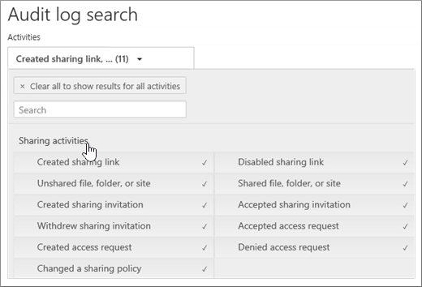

# Use sharing auditing in the Office 365 audit log

Sharing is a key activity in SharePoint Online and OneDrive for Business, and it's widely used in Office 365 organizations. Administrators can now use sharing auditing in the Office 365 audit log to determine how sharing is being used in their organization. 
  
## The SharePoint Sharing schema

Sharing events (excluding sharing policy and sharing link events) are different from file- and folder-related events in one primary way: one user is taking an action that has some effect on another user. For example, User A gives User B access to a file. In this example, User A is the  *acting user*  and User B is the  *target user*. In the SharePoint File schema, the acting user's action only affects the file itself. When User A opens a file, the only information needed in the **FileAccessed** event is the acting user. To address this difference, there is a separate schema, called the  *SharePoint Sharing schema*, that captures more information about sharing events. This ensures that administrators have more insight into who shared a resource and the user the resource was shared with. 
  
The Sharing schema provides two additional fields in the audit log related to sharing events: 
  
- **TargetUserOrGroupName** - Stores the UPN or name of the target user or group that a resource was shared with (User B in the previous example). 
    
- **TargetUserOrGroupType** - Identifies whether the target user or group is a Member, Guest, Group, or Partner. 
    
These two fields, in addition to other properties from the Office 365 audit log schema such as User, Operation, and Date can tell the full story about  *which*  user shared  *what*  resource with  *whom*  and  *when*. 
  
There's another schema property that's important to the sharing story. The **EventData** property stores additional information about sharing events. For example, when a user shares a site with another user, this is accomplished by adding the target user to a SharePoint group. The **EventData** property captures this additional information to provide context for administrators. 

## The SharePoint Sharing model and sharing events

Sharing is actually defined by three separate events: **SharingSet**, **SharingInvitationCreated**, and **SharingInvitaitonAccepted**. Here's the work flow for how sharing events are logged in the Office 365 audit log. 
  

  
When a user (the acting user) wants to share a resource with another user (the target user), SharePoint (or OneDrive for Business) first checks if the email address of the target user is already associated with a user account in the organization's directory. If the target user is in the organization's directory, SharePoint does the following:
  
-  Immediately assigns the target user permissions to access the resource. 
    
- Sends a sharing notification to the email address of the target user.
    
- Logs a **SharingSet** event. 
    
 If a user account for the target user isn't in the organization's directory, SharePoint does the following: 
  
- Creates a sharing invitation and sends it to the email address of the target user.
    
- Logs a **SharingInvitationCreated** event. 
    
    > [!NOTE]
    > The **SharingInvitationCreated** event is most always associated with external or guest sharing when the target user doesn't have access to the resource that was shared. 
  
When the target user accepts the sharing invitation that's sent to them (by clicking the link in the invitation), SharePoint logs a **SharingInvitationAccepted** event and assigns the target user permissions to access the resource. Additional information about the target user is also logged, such as the identity of the user that the invitation was sent to and the user who actually accepted the invitation. In some case, these users (or email addresses) might be different. 
  

  
## How to identify resources shared with external users

A common requirement for administrators is creating a list of all resources that have been shared with users outside of the organization. By using sharing auditing in Office 365, administrators can now generate this list. Here's how.
  
### Step 1: Search for sharing events and export the results to a CSV file

The first step is to search the Office 365 audit log for sharing events. For more details (including the required permissions) about searching the audit log, see [Search the audit log in the Office 365 Security &amp; Compliance Center](search-the-audit-log-in-security-and-compliance.md).
  
1. Go to [https://protection.office.com](https://protection.office.com).
    
2. Sign in to Office 365 using your work or school account.
    
3. In the left pane of the Security &amp; Compliance Center, click **Search &amp; investigation**, and then click **Audit log search**.
    
    The **Audit log search** page is displayed. 
    
4. Under **Activities**, click **Sharing activities** to search only for sharing events. 
    
    
  
5.  Select a date and time range to find the sharing events that occurred within that period. 
    
6. Click **Search** to run the search. 
    
7. When the search is finished running and the results are displayed , click **Export results** \> **Download all results**.
    
    After you select the export option, a message is displayed at the bottom of the window that prompts you to open or save the CSV file.
    
8. Click **Save** \> **Save as** and save the CSV file to a folder on your local computer. 
    

  
### Step 2: Filter the CSV file for resources shared with external users

The next step is to filter the CSV for the **SharingSet** and **SharingInvitationCreated** events, and to display those events where the **TargetUserOrGroupType** property is **Guest**. You'll use the Power Query feature in Excel to do this. The following procedure is performed in Excel 2016. 
  
1. In Excel 2016, open a blank workbook.
    
2. Click the **Data** tab. 
    
3. Click **New Query** \> **From file** \> **From CSV**.
    
    
  
4. Open the CSV file that you downloaded in Step 1.
    
    The CSV file is opened in the Query Editor. Note that there are four columns: **Time**, **User**, **Action**, and **Detail**. The **Detail** column is a multi-property field. The next step is to create a new column for each of the properties in the **Detail** column. 
    
5. Select the **Detail** column, and then on the **Home** tab, click **Split Column** \> **By Delimiter**.
    
    
  
6. In the **Split Column by Delimiter** window, do the following: 
    
      - Under **Select or enter delimiter**, select **Comma**.
    
      - Under **Split**, select **At each occurrence of the delimiter**.
    
7. Click **OK**.
    
    The **Detail** column is split into multiple columns. Each new column is named **Detail.1**, **Detail.2**, **Detail.3**, and so on. You'll notice the values in each cell in the **Detail.n** columns are prefixed with the name of the property; for example, **Operation:SharingSet**, **Operation:SharingInvitationAccepted**, and **Operation:SharingInvitationCreated**.
    
    
  
8. On the **File** tab, click **Close &amp; Load** to close the Query Editor and open the file in an Excel workbook. 
    
    The next step is to filter the file to only display the **SharingSet** and **SharingInvitationCreated** events. 
    
9. Go to the **Home** tab, and then select the **Action** column. 
    
10. In the **Sort &amp; Filter** drop-down list, clear all selections, then select **SharingSet** and **SharingInvitationCreated**, and click **OK**.
    
    Excel displays the rows for the **SharingSet** and **SharingInvitationCreated** events. 
    
11. Go to the column named **Detail.17** (or whichever column contains the **TargetUserOrGroupType** property) and select it. 
    
12. In the **Sort &amp; Filter** drop-down list, clear all selections, then select **TargetUserOrGroupType:Guest**, and click **OK**.
    
    Now Excel displays the rows for **SharingInvitationCreated** and **SharingSet** events AND where the target user is outside of your organization, because external users are identified by the value **TargetUserOrGroupType:Guest**. 
    
The following table shows all users in the organization who shared resources with a guest user within a specified date range.
  

  
Although it's not included in the previous table, the **Detail.10** column (or whichever column contains the **ObjectId** property) identifies the resource that was shared with the target user; for example  `ObjectId:https:\/\/contoso-my.sharepoint.com\/personal\/sarad_contoso_com\/Documents\/Southwater Proposal.docx`.
  
> [!TIP]
> If you want to identify when a guest user was actually assigned permissions to access a resource (as opposed to just the resources that where shared with them), repeat Steps 10, 11, and 12, and filter on the **SharingInvitationAccepted** and **SharingSet** events in Step 10. 
